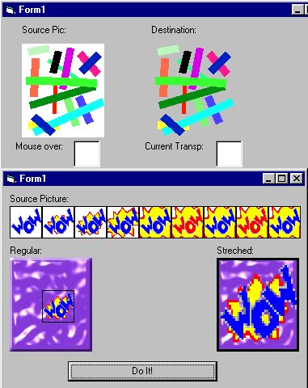



## Transparent Bitmap/GIF/JPG with one line of code\!

### Description

While surfing the web i found the API for a function named TransparentBlt in C++ and i changed it over to VB. If you like BitBlt, your going to love this. 2 examples on how to use this API, one deals with a transparent animation, and the other is just a basic example using GetPixel API. Enjoy, cause this is a god-sent for me.
 
### More Info
 

             |
---                |---
**Submitted On**   |2000-10-16 19:22:54
**By**             |[Andrew Heinlein \(Mouse\)](https://github.com/Planet-Source-Code/PSCIndex/blob/master/ByAuthor/andrew-heinlein-mouse.md)
**Level**          |Beginner
**User Rating**    |4.5 (149 globes from 33 users)
**Compatibility**  |VB 5\.0, VB 6\.0
**Category**       |[Windows API Call/ Explanation](https://github.com/Planet-Source-Code/PSCIndex/blob/master/ByCategory/windows-api-call-explanation__1-39.md)
**World**          |[Visual Basic](https://github.com/Planet-Source-Code/PSCIndex/blob/master/ByWorld/visual-basic.md)
**Archive File**   |[CODE\_UPLOAD1070110162000\.zip](https://github.com/Planet-Source-Code/andrew-heinlein-mouse-transparent-bitmap-gif-jpg-with-one-line-of-code__1-12095/archive/master.zip)

